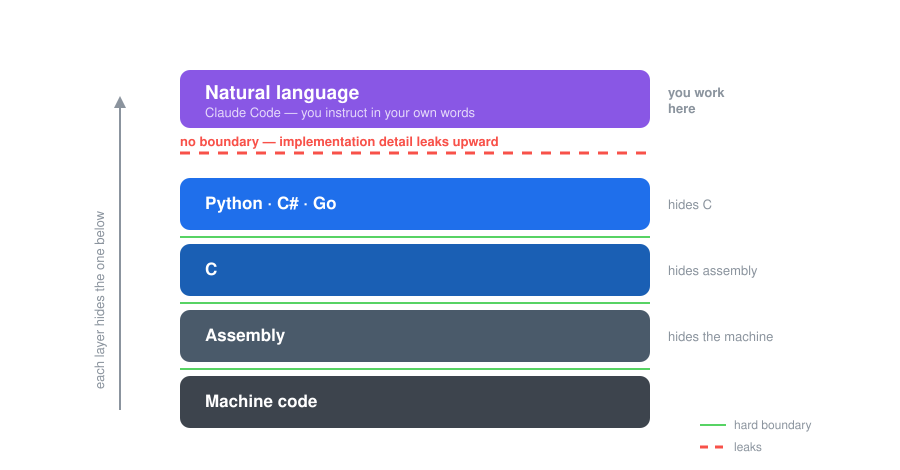
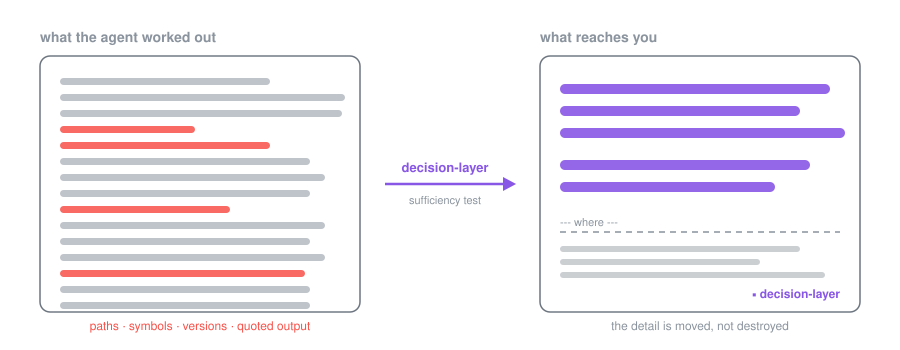

<div align="center">

# Big Picture

### Claude Code plugins that fix what your agent tells you — not what you tell it.

[](LICENSE)
[](https://claude.com/claude-code)
[](evals/)

<br>



</div>

Every step on that ladder shipped with a **hard boundary**. You write Python without reading
the assembly it becomes, and that is not a loss — it is the entire point of the step.

The newest step did not ship one. So the detail leaks upward, and you get answers full of
code you never agreed to read, cannot check, and cannot decide on.

**These plugins put the boundary back.**

---

## See the difference

<div align="center">

<sub>SOMEONE ASKED</sub>

### “The release goes out tonight. The build now fails on the server<br>but works on my laptop. What should we do?”

</div>

<details>
<summary>&nbsp;&nbsp;what they pasted in</summary>

```
Exception in thread "main" java.lang.NoSuchMethodError: 'void com.google.common.base.Preconditions.checkArgument(boolean, java.lang.String, java.lang.Object)'
	at org.apache.hadoop.conf.Configuration.set(Configuration.java:1357)
	at com.acme.ingest.SinkFactory.build(SinkFactory.java:88)
	at com.acme.ingest.Main.main(Main.java:41)

$ mvn dependency:tree -Dincludes=com.google.guava
[INFO] com.acme:ingest:jar:7.4.0
[INFO] +- com.acme:acme-storage:jar:3.2.0:compile
[INFO] |  \- com.google.guava:guava:jar:19.0:compile
[INFO] +- org.apache.hadoop:hadoop-common:jar:3.3.6:compile
[INFO] |  \- com.google.guava:guava:jar:27.0-jre:compile  (omitted for conflict with 19.0)
[INFO] \- com.acme:acme-metrics:jar:1.9.4:compile
[INFO]    \- com.google.guava:guava:jar:32.1.3-jre:compile (omitted for conflict with 19.0)
[WARNING] Used undeclared dependencies found: com.google.guava:guava:jar:19.0
```

</details>

<div align="center">

**↓ &nbsp; answered twice &nbsp; ↓**

</div>

<table>
<tr>
<th width="45%">❌ &nbsp; Without decision-layer</th>
<th width="10%"></th>
<th width="45%">✅ &nbsp; With decision-layer</th>
</tr>
<tr valign="top">
<td>

🔎 **Root cause: two versions of Guava are fighting, and the wrong one won.**

Three different things in your project want different Guava versions:
- `acme-storage` wants 19.0 (old)
- `hadoop-common` wants 27.0
- `acme-metrics` wants 32.1.3 (new)

Maven can only put **one** copy of Guava on the classpath, so it "mediates" — picks one.
Its rule is "nearest wins, and if it's a tie, whoever is listed first in the pom wins."

✅ **Fix for tonight (low risk, ~10 minutes):**

1. In the parent `pom.xml`, add a `<dependencyManagement>` entry pinning Guava to
   **32.1.3-jre**.
2. Add Guava as an **explicit direct dependency** of the `ingest` module.
3. Re-run `mvn dependency:tree -Dincludes=com.google.guava` — confirm only one version
   shows, no more "omitted for conflict" lines.
4. Rebuild and smoke-test the ingest path before shipping.

</td>
<td align="center" valign="middle">

# ➜

</td>
<td>

The crash is a version mismatch, not a code bug: your app is pulling in an old copy of a
shared library, and something else it depends on expects a newer copy.

For tonight, the fix is to pin the version explicitly instead of trusting the default
tie-break. That's a small, low-risk change.

Before you ship, don't treat "works on my laptop" as proof — do a clean rebuild on the
server side and confirm only one copy of the library shows up. **If that comes back
clean, ship. If it doesn't resolve in the time you have left, slipping the release is the
safer call than shipping a build you can't currently reproduce.**

```
--- where ---
```

1. `hadoop-common:3.3.6` needs Guava ≥27 for
   `Preconditions.checkArgument(boolean, String, Object)`; Maven's "nearest declaration
   wins" mediation picked `guava:19.0`.

`▪ decision-layer`

</td>
</tr>
</table>

<div align="center">

<sup>☝️ that last line, <code>▪ decision-layer</code>, is how you know it was on</sup>

<br>

| measured on the two full replies | ❌ without | ✅ with |
|---|:---:|:---:|
| **Length of the reply** | 459 words | **191 words** |
| **Code shown to you in the prose** | **23 snippets** | **0** |
| **Times the library is named** | **11** | **0** |
| **Config steps handed back to you** | 4 | none |
| **Ends with a decision you can make** | no | **ship, or slip** |

</div>

> [!IMPORTANT]
> The left column is not wrong. It is a good technical answer, and if you write Java it is
> the one you want.
>
> But the person asking has a release going out tonight, and what they need to know is
> whether to ship. Only the right column answers that — **"if that comes back clean, ship;
> if not, slipping is the safer call"** — and it does it without naming the library once.
>
> The detail is not gone. It is sitting under the line, waiting.

<sub>Both columns are real, unedited output from two live Claude Code sessions given the
identical question — one armed, one not. Run in a <b>clean install</b> holding this plugin
and nothing else: no personal instruction files, no project instructions, no other plugins,
so nothing but the boundary differs. Shortened here to fit the page; sentences were cut, no
word was changed. <b><a href="examples/dependency-conflict">Read the full replies →</a></b>
&nbsp;·&nbsp; <a href="examples">more examples</a></sub>

---

## How it works

<div align="center">



</div>

The agent still does all the work and still knows every detail. What changes is the
**contract on the way back**: the prose has to stand on its own, and anything you would need
a pointer for goes below a marked line, where it waits for you if you want it.

Nothing is thrown away. Ask for the code in plain words — *"show me that function"* — and the
boundary steps aside for that one reply.

**Every reply written under the boundary ends with `▪ decision-layer`.** That is how you
know it was on.

## Install

Three steps, about a minute.

**1 — Install the plugin.** In Claude Code:

```
/plugin marketplace add VincentHHY/big-picture
/plugin install decision-layer@big-picture
```

**2 — Select the output style, once.**

```
/decision-layer setup
```

That one command makes the boundary available in every project — in the terminal, the VS Code
extension and the desktop app alike — and step 3 is how you actually use it.

> [!IMPORTANT]
> **Step 3 will not work in this session.** Claude Code reads the output style once, when a
> session opens, so the session you ran step 2 in cannot see it. Until you start a new
> session or run `/clear`, step 3 accepts the command and changes nothing.

**3 — Turn it on whenever you want it.**

```
/decision-layer
```

That is the whole thing. `/decision-layer off` turns it off again, and **every new session
starts off**, so it never follows you into tomorrow.

Under the hood it is a single line, `"outputStyle": "decision-layer:Plain"`, written into your
own `~/.claude/settings.json`.

**Selecting it changes nothing by itself.** An output style normally rewrites every reply,
but this one is written to apply only to a turn the hook has marked. So a session you have
not armed reads exactly as it would with no output style selected at all.

<details>
<summary>&nbsp;&nbsp;rather set it yourself?</summary>

Add the `outputStyle` line to `~/.claude/settings.json`, or create that file with just this
in it:

```json
{
  "outputStyle": "decision-layer:Plain"
}
```

A terminal also has a picker — `/config` → **Output style** — but it saves your choice into
`.claude/settings.local.json` inside the project you are standing in, so it covers that one
project. The VS Code extension and the desktop app have no picker at all: the extension lists
**Output styles** in its `/` menu and then points you back to a terminal, and the desktop
app's `/config` opens Settings → Claude Code instead.

</details>

### If it is not working

- **Replies have no `▪ decision-layer` footer.** Step 2 was skipped, or did not take. The
  plugin says so at the start of every session when the style is not selected — without it
  there is nothing to arm, and that is the one failure that otherwise leaves no trace.
- **The terminal picker only took effect in one project.** That is where it saves: into
  `.claude/settings.local.json`, inside the project you were in, and it has no global option.
  Run `/decision-layer setup` instead, or move the `outputStyle` line into
  `~/.claude/settings.json` yourself.
- **An output style you were already using stopped applying.** Claude Code holds one output
  style at a time, so selecting this one takes the slot. Put the old name back into
  `~/.claude/settings.json` to return to it — `/decision-layer setup` tells you which name it
  took over from.
- **The command menu shows the name twice**, as `decision-layer:decision-layer`. That is
  Claude Code filing a skill under the name of the plugin that ships it. The short
  `/decision-layer` works; type that.
- **Nothing happens at all.** The plugin needs `bash` and Python 3 on your `PATH`. macOS and
  Linux have both already; on Windows, Git Bash provides `bash`.

Full documentation, including the escape hatches and how the pieces fit together:
**[plugins/decision-layer](plugins/decision-layer)**.

## Does it hold up?

Not a style guide anyone hopes is being followed. Every case runs as a **real armed session**
driven by the live hook and the live output style, and the headline judge is a grader that
sees only the prose — never the code, the fixture, or the question. That is the reader's
actual situation.

<div align="center">

| | ✅ with decision-layer | ❌ without |
|---|:---:|:---:|
| **reader could follow it** | **100%** | 20–40% |
| mechanical checks passed | 91–100% | 18–40% |

</div>

Across **55** armed replies where the boundary was meant to apply, the reader was blocked
**once**.

## Licence

MIT.
